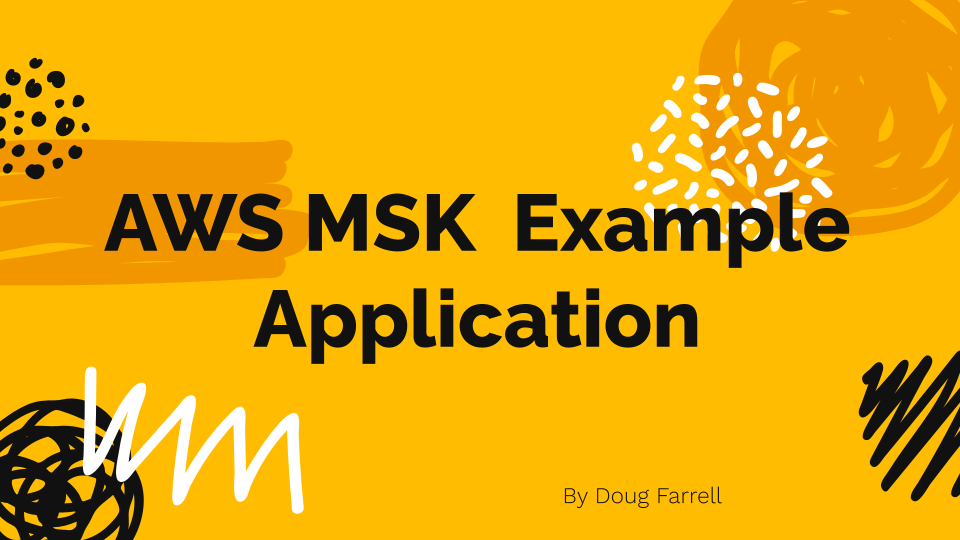

# AWS MSK Pub/Sub Example for EKS with FastAPI

This repository demonstrates a simple publish/subscribe application using AWS MSK (Managed Streaming for Apache Kafka) with a FastAPI service designed for Kubernetes (EKS) deployment. It highlights core Kafka capabilities: producing, consuming, topic fan‑out, and health/observability endpoints.

- Source code: src/
- Deployment (AWS CDK): deploy/
- Local Kafka (Docker Compose): docker-compose.yaml
- Diagram: docs/images/aws_msk_example.png

## Architecture

At a high level:
- A FastAPI service exposes REST endpoints to publish messages and inspect recent consumed messages.
- The service uses faststream’s KafkaBroker to connect to Kafka/MSK and subscribes to topics.
- Two demo topics are used by default: user-events and system-alerts.
- A periodic background task publishes a system alert every 10 seconds to demonstrate continuous traffic.

Key components:
- FastAPI app: src/main.py
- API routes: src/api/router.py
- Pydantic models: src/api/models.py
- Kafka integration: src/helpers/broker.py (faststream KafkaBroker)
- Configuration: src/helpers/config.py

## Prerequisites
- Python 3.13+
- Docker and Docker Compose (for local Kafka)
- Node.js + AWS CDK v2 (for AWS deployment) and AWS CLI configured
- kubectl configured for your EKS cluster (for deployment testing)

## Environment Variables
- MSK_CLUSTER_NAME: Name of the MSK cluster (default: eks-pubsub-cluster)
- AWS_REGION: AWS region (default: us-east-1)
- CONSUMER_GROUP_ID: Kafka consumer group ID (default: eks-app-group)
- KAFKA_TOPICS: Comma-separated list (default: user-events,system-alerts)
- KAFKA_BOOTSTRAP_SERVERS: Bootstrap servers (default: localhost:9092 for local dev)
- PORT: FastAPI port (default: 8000)
- AUTO_OFFSET_RESET: Consumer offset reset policy (default: latest)
- MAX_BUFFER_SIZE: In-memory message buffer size (default: 1000)

Security protocol is automatically set to SSL when not using localhost:9092 and PLAINTEXT for local development.

## Local Development
You can run the full stack locally with Docker Compose for Kafka and your local Python environment for the API.

1) Start local Kafka and UI
- docker compose up -d
- Kafka UI will be at http://localhost:8080

2) Create and activate a virtual environment; install dependencies
- python -m venv .venv
- source .venv/bin/activate  # Windows: .venv\Scripts\activate
- pip install -r deploy/requirements.txt || true  # optional for CDK usage later
- pip install -U pip

Install runtime dependencies (from pyproject.toml):
- pip install -e .

3) Run the FastAPI service
From the repository root (ensures src/ is importable):
- PORT=8081 uvicorn src.main:app --host 0.0.0.0 --port ${PORT:-8081}

Notes:
- PORT 8081 avoids conflict with the Kafka UI (8080). Adjust as needed.
- KAFKA_BOOTSTRAP_SERVERS defaults to localhost:9092 when using docker-compose.

For more local dev details, see LOCAL_KAFKA_SETUP.md.

## API Endpoints
All endpoints are under /api/v1.
- GET /api/v1/health — Liveness probe with Kafka connectivity flag
- GET /api/v1/ready — Readiness probe
- POST /api/v1/publish — Publish a message
- GET /api/v1/messages — Get recent consumed messages (in-memory buffer)
- GET /api/v1/topics — Show configured topics and MSK/consumer info
- GET /api/v1/metrics — Basic runtime metrics

Example publish request:
- curl -X POST "http://localhost:8081/api/v1/publish" \
  -H "Content-Type: application/json" \
  -d '{"topic":"user-events","message":{"userId":123,"action":"signup"},"key":"user-123"}'

List recent messages:
- curl "http://localhost:8081/api/v1/messages?limit=20"

Health and readiness:
- curl "http://localhost:8081/api/v1/health"
- curl "http://localhost:8081/api/v1/ready"

## Running Tests
Basic tests are included to validate connectivity and consumer behavior.
- Ensure Kafka is running (docker compose up -d)
- Activate your virtualenv
- python -m pytest -q

## Deploying to AWS (MSK + EKS)
This project includes a CDK stack that provisions an MSK cluster and supporting resources suitable for use by EKS workloads.

Option A) CDK directly
1) Setup CDK environment
- cd deploy
- python -m venv .venv && source .venv/bin/activate
- pip install -r requirements.txt
- cdk bootstrap  # first time per account/region

2) Deploy
- cdk deploy

After deployment, configure the FastAPI application’s environment variables in your Kubernetes manifests or Helm chart. Point KAFKA_BOOTSTRAP_SERVERS to the MSK TLS brokers exposed by your MSK cluster.

## Configuration and Topics
Default topics are user-events and system-alerts (configurable via KAFKA_TOPICS). The app:
- Subscribes to both topics and keeps a bounded in-memory buffer for recent messages.
- Publishes a periodic system-alerts message every 10 seconds to demonstrate consumption.

## Security Considerations
- Use SSL for Kafka connections in AWS/MSK (automatic when not using localhost:9092).
- Scope network access with security groups; see deploy/deploy/deploy_stack.py.
- For production, implement API authentication/authorization and secrets management (e.g., IAM roles for service accounts, AWS Secrets Manager).

## Observability
- Structured logging is enabled via Python logging.
- Basic metrics are exposed via /api/v1/metrics.
- Kafka UI (local) provides topic, consumer group, and message inspection at http://localhost:8080.

## Troubleshooting
- Broker connection issues locally: ensure Kafka is up (docker compose ps) and KAFKA_BOOTSTRAP_SERVERS=localhost:9092.
- TLS issues on AWS: verify security groups, MSK client broker endpoints, and that your pods have network access to the MSK brokers.
- No messages consumed: confirm topics exist and the periodic system-alerts is running (check logs) or publish to user-events using the API.

## Notes
- This repository is an example to showcase Kafka/MSK capabilities with a simple, focused FastAPI app. Adapt configuration and deployment for production readiness as needed.
